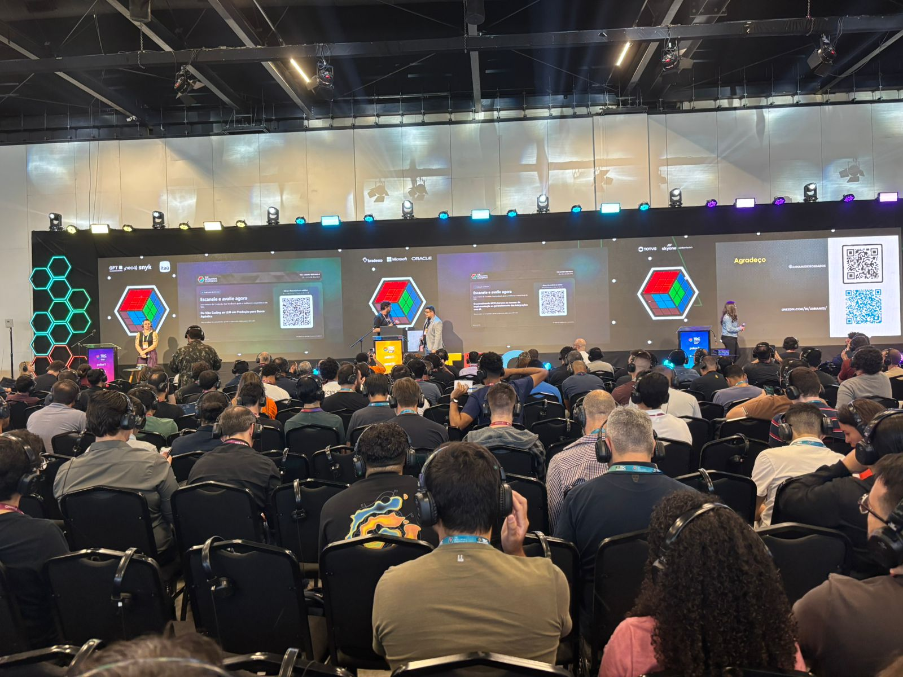
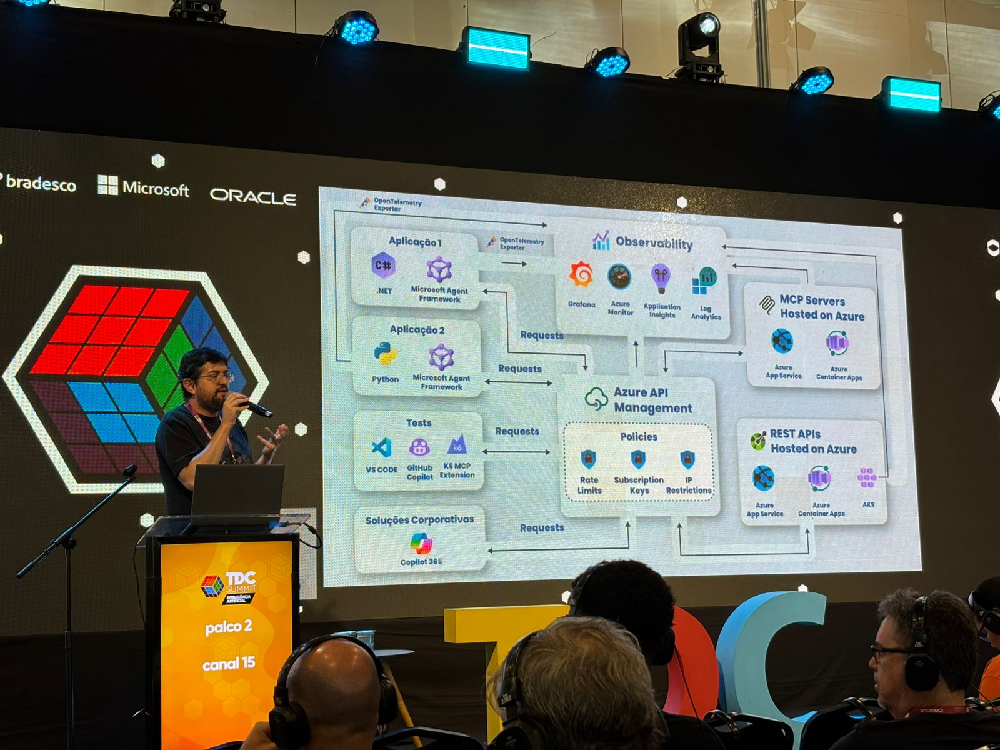
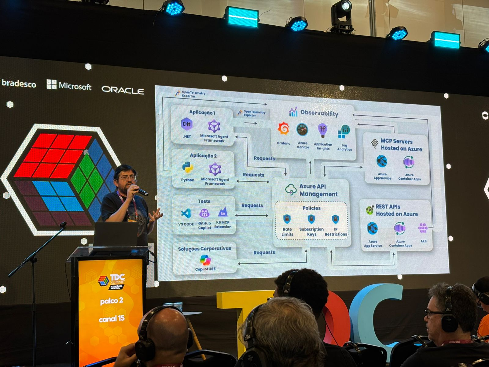
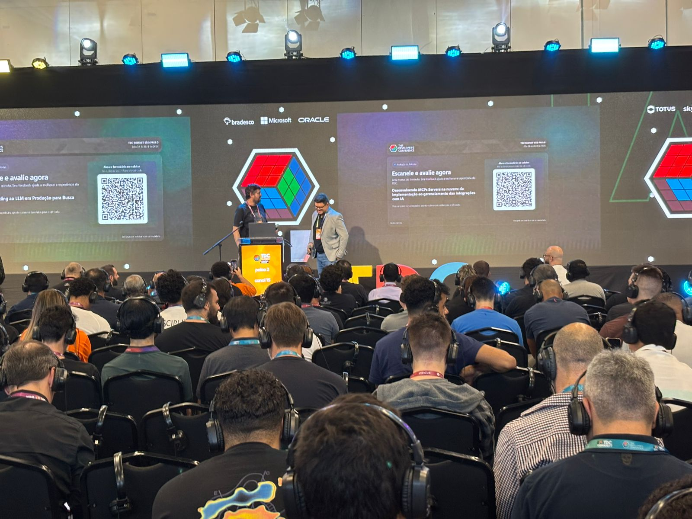
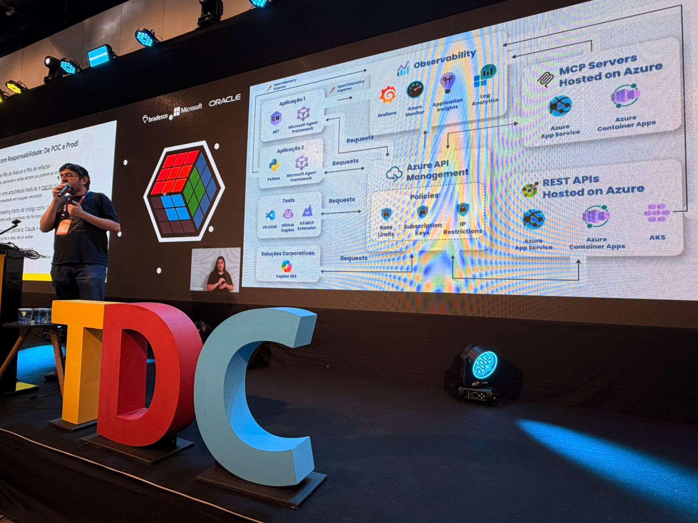
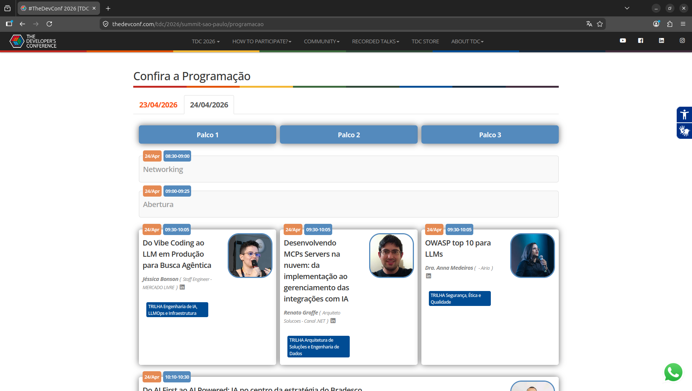

# mcp-nuvem_tdc-summit-ia-sp-2026
Content from the presentation "Developing MCP Servers in the Cloud: from implementation to managing AI integrations", delivered on April 24, 2026 at TDC Summit IA São Paulo 2026.

## Presentation examples (leave a star ⭐ to show your support)
- MCP Server Quote Simulation: https://github.com/renatogroffe/aspnetcore10-mcp-otel-appinsights-redis_simulacaocotacoes
- Console App for persisting Quotes in Redis: https://github.com/renatogroffe/dotnet10-consoleapp-redis_simulacaocotacoes
- Console App with chat querying the Quotes MCP Server: https://github.com/renatogroffe/dotnet10-agent-mcp-otel-azureappinsights_consultacotacoes
- Pipeline for MCP Server testing: https://github.com/renatogroffe/k6-mcps-tests-http-azdevops-pipelines

## References
- Model Context Protocol (MCP): https://github.com/modelcontextprotocol
- OpenTelemetry: https://opentelemetry.io/
- Microsoft Agent Framework: https://learn.microsoft.com/en-us/agent-framework/overview/?pivots=programming-language-csharp
- MCP Servers x Azure API Management: https://learn.microsoft.com/en-us/azure/api-management/mcp-server-overview
- Azure App Service: https://learn.microsoft.com/en-us/azure/app-service/
- Azure Container Apps: https://learn.microsoft.com/en-us/azure/container-apps/
- Azure Kubernetes Service: https://learn.microsoft.com/en-us/azure/aks/
- Azure Container Registry: https://learn.microsoft.com/en-us/azure/container-registry/
- Docker MCP Catalog: https://hub.docker.com/mcp
- Test MCP servers with k6: https://github.com/grafana/xk6-mcp
- Grafana GROT Academy (various free courses): https://learn.grafana.com/
- Azure DevOps: https://learn.microsoft.com/en-us/azure/devops/?view=azure-devops
- Azure Monitor: https://learn.microsoft.com/en-us/azure/azure-monitor/
- Application Insights: https://learn.microsoft.com/en-us/azure/azure-monitor/app/app-insights-overview
- Azure Log Analytics: https://learn.microsoft.com/en-us/azure/azure-monitor/logs/log-analytics-overview?tabs=simple
- GitHub Actions: https://docs.github.com/en/actions
- Free APIsec University Certifications: https://www.apisecuniversity.com/courses

---

# Event Information

Presentation title: **Developing MCP Servers in the Cloud: from implementation to managing AI integrations**

Event: **TDC Summit IA São Paulo 2026**

Date: **April 24, 2026 (Friday)**

Technologies and topics covered: **MCP, Artificial Intelligence, .NET, Python, Microsoft Foundry, Microsoft Agent Framework, OpenTelemetry, Application Insights, Azure Monitor, Azure Log Analytics, Azure API Management, Azure App Service, Azure Container Apps, Kubernetes, Azure Kubernetes Service, Docker, npm, NuGet, Java, Node.js, k6, Grafana, Azure Managed Grafana, OWASP...**

Number of attendees: **250 people (estimate, in-person + online)**

Event website: **https://thedevconf.com/tdc/2026/summit-sao-paulo/programacao**

Venue: **Distrito Anhembi - Avenida Olavo Fontoura, 1209 - Santana - São Paulo-SP - ZIP: 02001-900**

---

